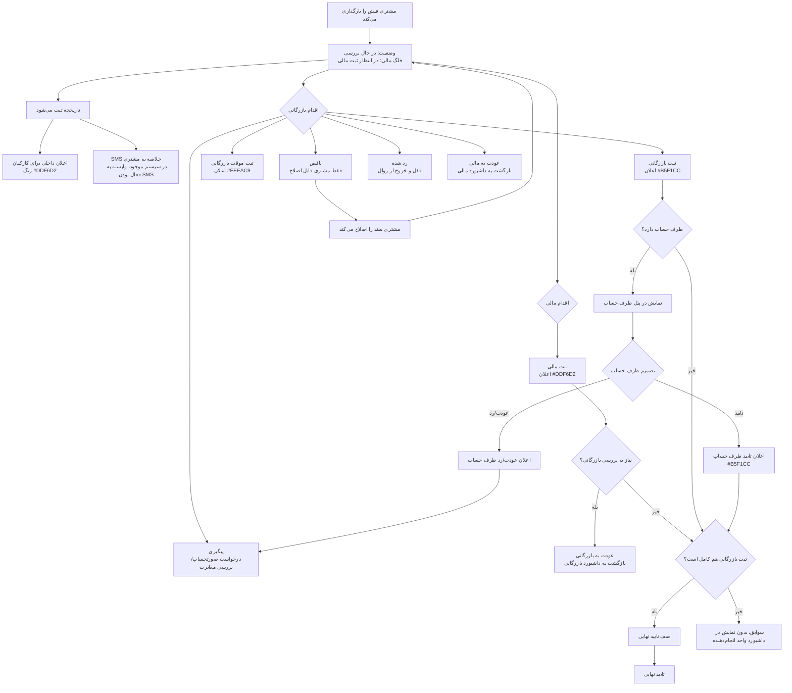

# Payment Receipt Workflow

## خلاصه روال نهایی

این سند، گردش نهایی فیش‌های ثبت‌شده توسط مشتری را توضیح می‌دهد. هدف اصلی این است که داشبورد هر واحد فقط کارهای نیازمند اقدام را نشان دهد و اسناد انجام‌شده در سوابق باقی بمانند.

## وضعیت‌ها و فلگ‌ها

- `در حال بررسی`: وضعیت اولیه پس از ثبت فیش توسط مشتری.
- `ثبت موقت بازرگانی`: فیش از نظر بازرگانی قطعی نیست و نیاز به بررسی بیشتر دارد.
- `ثبت بازرگانی`: عملیات بازرگانی انجام شده و سند از داشبورد بازرگانی خارج می‌شود.
- `ثبت مالی`: فلگ مستقل مالی است و پس از ثبت مالی، سند از داشبورد مالی خارج می‌شود.
- `عودت به مالی`: بازرگانی سند را برای اقدام مجدد مالی به صف مالی برمی‌گرداند.
- `عودت به بازرگانی`: مالی سند ثبت‌شده را برای بررسی دوباره بازرگانی برمی‌گرداند.
- `پیگیری`: بازرگانی برای مغایرت یا تایید نشدن طرف حساب، سند را در حالت پیگیری نگه می‌دارد.
- `ناقص`: فقط مشتری می‌تواند سند را طبق توضیح کارشناس اصلاح کند.
- `رد شده`: سند قفل و از روال عملیاتی خارج می‌شود.
- `تایید نهایی`: وقتی ثبت بازرگانی، ثبت مالی و در صورت وجود طرف حساب، تایید طرف حساب کامل باشد.

## رنگ اعلان‌ها

- ثبت فیش توسط مشتری: `#DDF6D2`
- ثبت مالی: `#DDF6D2`
- ثبت بازرگانی: `#B5F1CC`
- ثبت موقت بازرگانی: `#FEEAC9`
- تایید طرف حساب: `#B5F1CC`
- عودت طرف حساب یا پیگیری: `#FEEAC9`
- رد طرف حساب یا رد سند: `#FECACA`
- عودت به بازرگانی: `#E9D5FF`
- عودت به مالی: `#DBEAFE`

## فلوچارت

