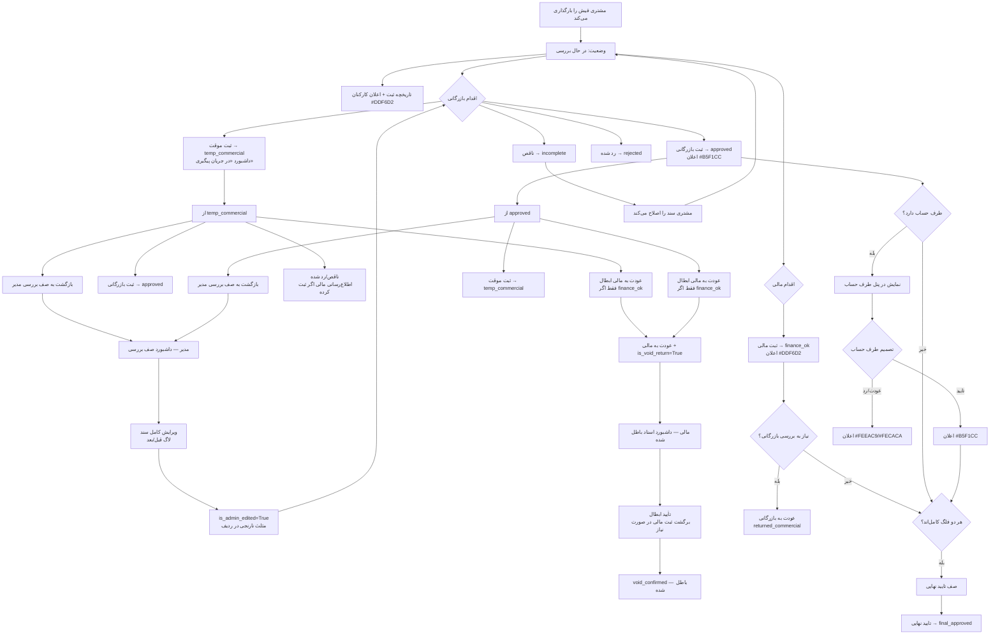

# گردش کار فیش‌های واریزی

## خلاصه روال نهایی

این سند، گردش نهایی فیش‌های ثبت‌شده توسط مشتری را توضیح می‌دهد. هدف اصلی این است که داشبورد هر واحد فقط کارهای نیازمند اقدام را نشان دهد و اسناد انجام‌شده در سوابق باقی بمانند.

آخرین به‌روزرسانی: ۱۴۰۵/۰۶/۱۴

## وضعیت‌ها و فلگ‌ها

### وضعیت‌های اصلی (فلگ بازرگانی)

| مقدار فنی | عنوان نمایشی | معنی |
| --- | --- | --- |
| `pending` | در حال بررسی | فیش تازه ثبت شده، منتظر بررسی |
| `commercial_review` | در حال بررسی بازرگانی | سند در صف بررسی اولیه بازرگانی — به‌صورت خودکار پس از ثبت تنظیم می‌شود |
| `temp_commercial` | ثبت موقت بازرگانی | بازرگانی سند را موقتاً ثبت کرده؛ نیاز به پیگیری بیشتر دارد |
| `approved` | ثبت بازرگانی | عملیات بازرگانی کامل شده |
| `final_approved` | تایید نهایی | هر دو فلگ کامل‌اند و تایید نهایی انجام شده |
| `rejected` | رد شده | سند قفل و از روال خارج شده |
| `incomplete` | ناقص | فقط مشتری می‌تواند سند را اصلاح کند |
| `returned_commercial` | عودت به بازرگانی | مالی سند را برای بررسی مجدد به بازرگانی عودت داده |
| `returned_finance` | عودت به مالی | بازرگانی سند را به مالی عودت داده (برای ابطال یا بررسی) |
| `void_confirmed` | باطل شده | ابطال سند توسط مالی تأیید شده — از روال خارج است |

> **نکته**: وضعیت `follow_up` (پیگیری) از سیستم حذف شده است. جایگزین آن برای مواردی که نیاز به بررسی مدیر است، گزینه «بازگشت به صف بررسی» است.

### فلگ مالی (مستقل)

| مقدار | معنی |
| --- | --- |
| `None` | در انتظار ثبت مالی |
| `finance_ok` | ثبت مالی انجام شده |

### فلگ‌های ویرایش مدیر

| فلگ | نوع | معنی |
| --- | --- | --- |
| `needs_admin_review` | BooleanField | سند در صف بررسی مدیر سیستم است |
| `is_admin_edited` | BooleanField | سند توسط مدیر سیستم ویرایش شده — مثلث نارنجی در گوشه ردیف جدول نمایش داده می‌شود |

### فلگ‌های ابطال

| فلگ | نوع | معنی |
| --- | --- | --- |
| `is_void_return` | BooleanField | این عودت برای ابطال سند است، نه بررسی مجدد |
| `void_reason` | TextField | دلیل ابطال که بازرگانی ثبت می‌کند |

---

## اقدامات بازرگانی

### از وضعیت «در حال بررسی بازرگانی» یا «ثبت بازرگانی»

| اقدام | شرط | نتیجه |
| --- | --- | --- |
| ثبت موقت بازرگانی | از `commercial_review` یا `approved` | وضعیت → `temp_commercial` |
| ثبت بازرگانی | از `commercial_review` | وضعیت → `approved` |
| ناقص | — | وضعیت → `incomplete` |
| رد شده | — | وضعیت → `rejected` |
| بازگشت به صف بررسی | از `temp_commercial`, `approved`, `incomplete`, `rejected` | `needs_admin_review=True` |

### از وضعیت «ثبت موقت بازرگانی»

| اقدام | شرط | نتیجه |
| --- | --- | --- |
| ثبت بازرگانی | — | وضعیت → `approved` |
| عودت به مالی (ابطال) | `finance_status == finance_ok` | وضعیت → `returned_finance` + `is_void_return=True` |
| ناقص | — | وضعیت → `incomplete`؛ اگر مالی ثبت کرده باشد → اطلاع‌رسانی به مالی |
| رد شده | — | وضعیت → `rejected`؛ اگر مالی ثبت کرده باشد → اطلاع‌رسانی به مالی |
| بازگشت به صف بررسی | — | `needs_admin_review=True` |

### از وضعیت «ثبت بازرگانی»

| اقدام | شرط | نتیجه |
| --- | --- | --- |
| ثبت موقت بازرگانی | — | وضعیت → `temp_commercial`؛ اگر مالی ثبت کرده → اطلاع‌رسانی به مالی |
| عودت به مالی (ابطال) | `finance_status == finance_ok` | وضعیت → `returned_finance` + `is_void_return=True` |
| ناقص | — | وضعیت → `incomplete` |
| رد شده | — | وضعیت → `rejected` |
| بازگشت به صف بررسی | — | `needs_admin_review=True` |

> **قانون «عودت به مالی»**: این گزینه **فقط** برای ابطال سند است. برگشت‌پذیر نیست مگر توسط ادمین. شرط لازم: `finance_status == finance_ok`.

---

## روال ابطال

```
بازرگانی (از temp_commercial یا approved)
    → عودت به مالی (is_void_return=True)
    → مالی در داشبورد «اسناد باطل شده» می‌بیند
    → مالی «تأیید ابطال» می‌زند:
        - اگر finance_status == finance_ok → ابتدا ثبت مالی برگشت می‌خورد
        - وضعیت → void_confirmed
        - اطلاع‌رسانی به بازرگانی و مشتری
```

---

## روال بازگشت به صف بررسی مدیر

```
بازرگانی (از temp_commercial، approved، incomplete، rejected)
    → بازگشت به صف بررسی
    → needs_admin_review=True
    → مدیر سیستم در داشبورد «صف بررسی مدیر» می‌بیند
    → مدیر فرم کامل ویرایش را پر می‌کند:
        - تمام تغییرات با مقادیر قبل/بعد لاگ می‌شود
        - is_admin_edited=True
        - needs_admin_review=False
        - اطلاع‌رسانی به بازرگانی و مالی
    → سند در هر دو داشبورد بازرگانی و مالی ظاهر می‌شود
    → ردیف سند با مثلث نارنجی در گوشه علامت‌گذاری می‌شود
```

---

## داشبوردها

| داشبورد | دسترسی | محتوا |
| --- | --- | --- |
| صف کاری اسناد | کارکنان | اسناد نیازمند اقدام |
| در جریان پیگیری | بازرگانی | اسناد با وضعیت `temp_commercial` |
| اسناد باطل شده | مالی | اسناد `returned_finance + is_void_return=True` |
| صف بررسی مدیر | فقط superuser | اسناد `needs_admin_review=True` |
| در انتظار تأیید نهایی | مالی / مدیر مالی | اسناد آماده تأیید نهایی |

---

## رنگ اعلان‌ها

| رخداد | رنگ |
| --- | --- |
| ثبت فیش توسط مشتری | `#DDF6D2` |
| ثبت مالی | `#DDF6D2` |
| ثبت بازرگانی | `#B5F1CC` |
| ثبت موقت بازرگانی | `#FEEAC9` |
| تایید طرف حساب | `#B5F1CC` |
| عودت/رد طرف حساب | `#FEEAC9` / `#FECACA` |
| رد سند | `#FECACA` |
| عودت به بازرگانی | `#E9D5FF` |
| عودت به مالی (ابطال — به مالی) | `#DBEAFE` |
| ابطال نهایی (به بازرگانی + مشتری) | `#FECACA` |
| بازگشت به صف بررسی مدیر | `#FEF3C7` |
| ویرایش توسط مدیر | `#FEF3C7` |

---

## نمایش وضعیت برای مشتری

مشتری همه وضعیت‌های داخلی را نمی‌بیند:

| وضعیت داخلی | نمایش به مشتری |
| --- | --- |
| `pending`, `commercial_review`, `temp_commercial`, `returned_commercial`, `returned_finance` | در حال بررسی |
| `approved` | ثبت بازرگانی |
| `final_approved` | تایید نهایی |
| `rejected` | رد شده |
| `incomplete` | ناقص |
| `void_confirmed` | باطل شده |

تغییرات مدیر: مشتری فقط «اطلاعات فیش تغییر کرد...» را می‌بیند، نه جزئیات.

---

## فلوچارت


