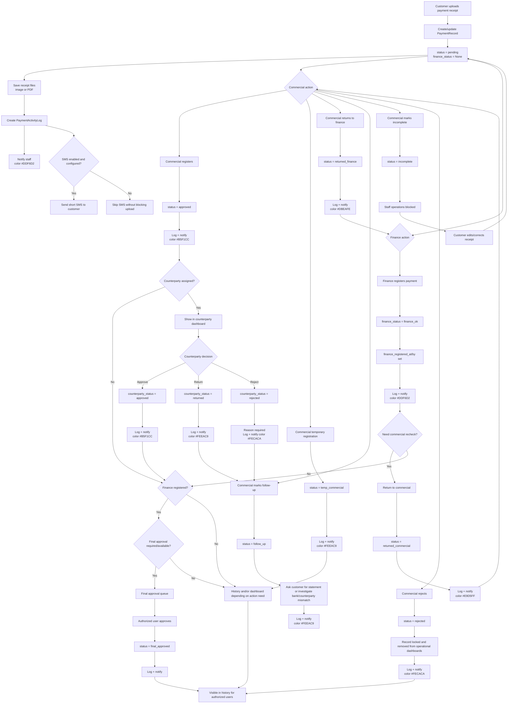
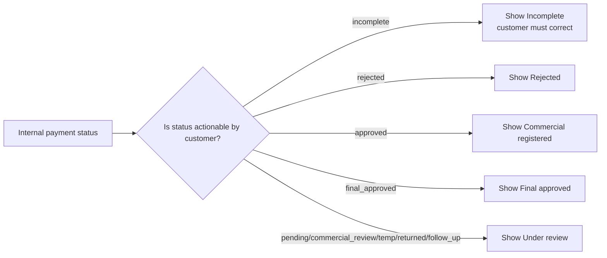
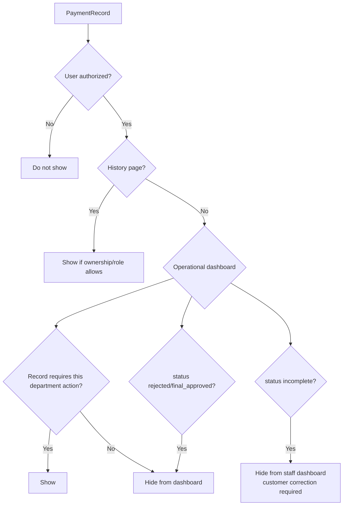

# Payment Receipt Workflow Flowchart

This document contains the full operational flow for customer payment receipts. It complements `docs/system_documentation_en.md`.

## Legend

- Main status is stored on `PaymentRecord.status`.
- Finance registration is stored independently on `PaymentRecord.finance_status`.
- Counterparty review is stored independently from finance and commercial decisions.
- Every important transition must write `PaymentActivityLog` and create relevant `UserNotification`.
- Operational dashboards show records that need action. History pages show all authorized records.

## Status Reference

| Status/flag | Code/value | Dashboard behavior |
| --- | --- | --- |
| Under review | `pending` | visible to staff dashboards |
| Commercial review | `commercial_review` | visible to commercial dashboard |
| Temporary commercial registration | `temp_commercial` | visible as pending/follow-up commercial state when action is needed |
| Commercial registered | `approved` | removed from commercial dashboard unless returned/follow-up |
| Finance pending | `finance_status=None` | visible to finance dashboard when finance action is needed |
| Finance registered | `finance_status='finance_ok'` | removed from finance dashboard unless returned/follow-up |
| Returned to commercial | `returned_commercial` | visible to commercial dashboard |
| Returned to finance | `returned_finance` | visible to finance dashboard |
| Follow-up | `follow_up` | visible to relevant staff dashboards |
| Incomplete | `incomplete` | staff operations blocked; customer correction required |
| Rejected | `rejected` | locked; hidden from operational dashboards |
| Final approved | `final_approved` | completed; history only |

## Full Flow

## Decision Table

| Decision | Condition | Result |
| --- | --- | --- |
| Can customer upload receipt? | User is authenticated customer and form/files are valid | Receipt is saved and status becomes `pending`. |
| Is SMS sent after upload? | SMS settings are configured and enabled | Short SMS is sent; otherwise operation continues without SMS. |
| Can finance register? | User has finance access and record is not locked/rejected/incomplete | `finance_status='finance_ok'`. |
| Can commercial register? | User has commercial access and record is not locked/rejected/incomplete | `status='approved'`. |
| Can commercial return to finance? | Commercial user decides finance action is needed | `status='returned_finance'`, record returns to finance dashboard. |
| Can finance return to commercial? | Finance user decides commercial review is needed | `status='returned_commercial'`, record returns to commercial dashboard. |
| Can staff operate incomplete record? | `status='incomplete'` | No; only customer correction should continue the flow. |
| Can staff operate rejected record? | `status='rejected'` | No; record is locked and history-only. |
| Can counterparty see record? | `payment.counterparty` matches linked counterparty user | Record appears in counterparty dashboard. |
| Can counterparty operate? | Counterparty status is `active` | Approve/return/reject is allowed. |
| Should dashboard show record? | Current state requires action from current user's department | Show in dashboard. |
| Should history show record? | User is authorized by role/ownership | Show regardless of status. |

## Notification Color Table

| Event | Color |
| --- | --- |
| Customer upload | `#DDF6D2` |
| Finance registration | `#DDF6D2` |
| Commercial registration | `#B5F1CC` |
| Temporary commercial registration | `#FEEAC9` |
| Counterparty approval | `#B5F1CC` |
| Counterparty return/follow-up | `#FEEAC9` |
| Counterparty rejection | `#FECACA` |
| Payment rejection | `#FECACA` |
| Return to commercial | `#E9D5FF` |
| Return to finance | `#DBEAFE` |

## Customer Display Rules

## Dashboard Visibility Rules

