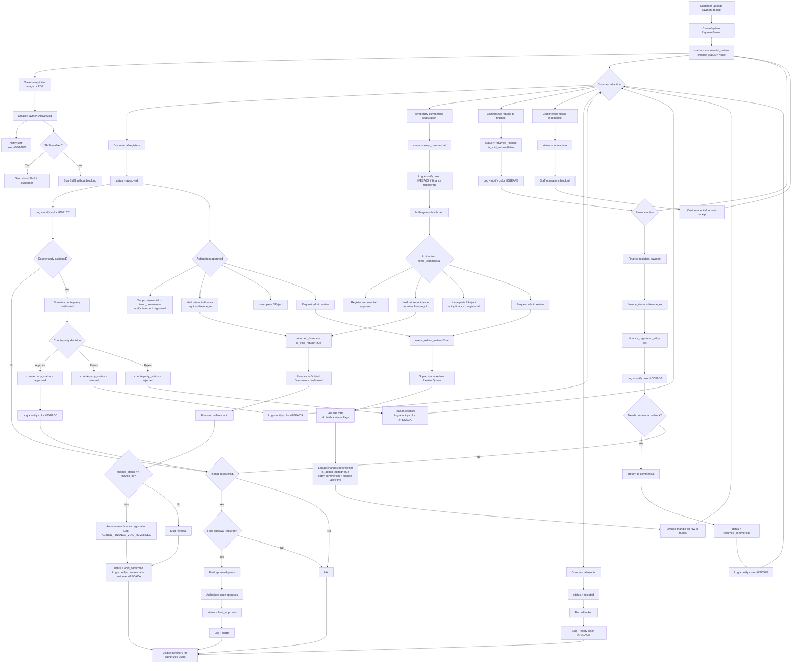
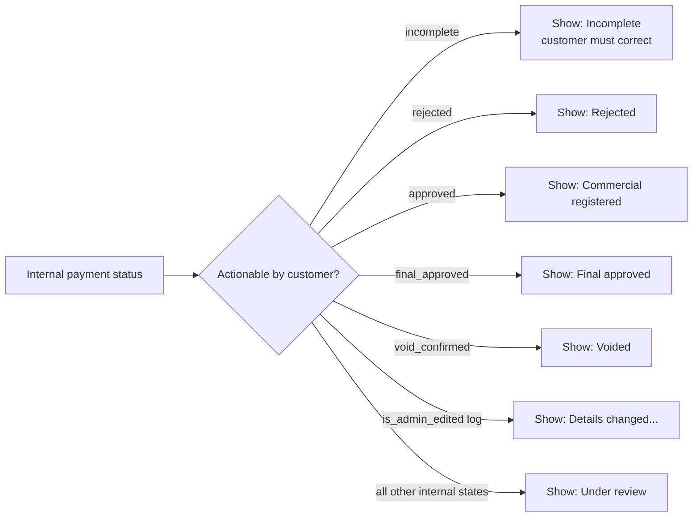
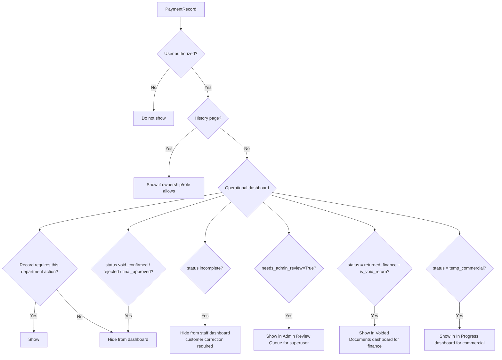

# Payment Receipt Workflow Flowchart

This document contains the full operational flow for customer payment receipts. It complements `docs/system_documentation_en.md`.

Last updated: 2026-09-05

## Legend

- Main status is stored on `PaymentRecord.status`.
- Finance registration is stored independently on `PaymentRecord.finance_status`.
- Counterparty review is stored independently from finance and commercial decisions.
- Every important transition must write `PaymentActivityLog` and create relevant `UserNotification`.
- Operational dashboards show records that need action. History pages show all authorized records.

## Status Reference

| Status/flag | Code/value | Dashboard behavior |
| --- | --- | --- |
| Under review | `pending` | visible to staff dashboards |
| Commercial review | `commercial_review` | visible to commercial dashboard; set automatically on creation |
| Temporary commercial registration | `temp_commercial` | visible in "In Progress" commercial dashboard; visible to finance if `finance_ok` |
| Commercial registered | `approved` | removed from commercial dashboard unless returned or voided |
| Finance pending | `finance_status=None` | visible to finance dashboard when finance action is needed |
| Finance registered | `finance_status='finance_ok'` | removed from finance dashboard unless returned |
| Returned to commercial | `returned_commercial` | visible to commercial dashboard |
| Returned to finance (regular) | `returned_finance` + `is_void_return=False` | visible to finance dashboard |
| Returned to finance (void) | `returned_finance` + `is_void_return=True` | visible only in Voided Documents dashboard |
| Incomplete | `incomplete` | staff operations blocked; customer correction required |
| Rejected | `rejected` | locked; hidden from operational dashboards |
| Voided | `void_confirmed` | permanently removed from all operational dashboards |
| Final approved | `final_approved` | completed; history only |
| Admin review needed | `needs_admin_review=True` | visible in Admin Review Queue (superuser only) |
| Admin edited | `is_admin_edited=True` | orange triangle shown in table row corners |

## Full Flow

## Decision Table

| Decision | Condition | Result |
| --- | --- | --- |
| Can customer upload receipt? | Authenticated customer; valid form/files | Status becomes `commercial_review`. |
| Is SMS sent after upload? | SMS settings are configured and enabled | Short SMS sent; otherwise operation continues. |
| Can finance register? | User has finance access; record is not locked/rejected/incomplete/voided | `finance_status='finance_ok'`. |
| Can commercial register? | User has commercial access; not locked/rejected | `status='approved'`. |
| Can commercial set temp? | From `commercial_review` or `approved` | `status='temp_commercial'`. |
| Can commercial void? | From `temp_commercial` or `approved`; `finance_status='finance_ok'` | `returned_finance + is_void_return=True`. |
| Can finance confirm void? | `status='returned_finance'` AND `is_void_return=True` | Single-step: auto-reverses finance reg if needed; `status='void_confirmed'`. |
| Can commercial request admin review? | From `temp_commercial`, `approved`, `incomplete`, `rejected` | `needs_admin_review=True`. |
| Can superuser admin-edit? | `is_superuser=True` | Full edit form; full before/after log; `is_admin_edited=True`. |
| Can finance return to commercial? | Finance user; record not locked/rejected | `status='returned_commercial'`. |
| Can staff operate incomplete record? | `status='incomplete'` | No; only customer correction continues flow. |
| Can staff operate rejected record? | `status='rejected'` | No; locked; history-only. |
| Can counterparty see record? | `payment.counterparty` matches linked counterparty user | Appears in counterparty dashboard. |
| Should dashboard show record? | Current state requires action from current department | Show in dashboard. |
| Should history show record? | User authorized by role/ownership | Show regardless of status. |

## Notification Color Table

| Event | Recipients | Color |
| --- | --- | --- |
| Customer upload | staff | `#DDF6D2` |
| Finance registration | commercial | `#DDF6D2` |
| Commercial registration | finance | `#B5F1CC` |
| Temp commercial registration | finance (only if finance_ok) | `#FEEAC9` |
| Counterparty approval | commercial | `#B5F1CC` |
| Counterparty return | commercial | `#FEEAC9` |
| Counterparty rejection | commercial | `#FECACA` |
| Payment rejection | commercial + customer | `#FECACA` |
| Return to commercial | commercial | `#E9D5FF` |
| Void return to finance | finance | `#DBEAFE` |
| Void confirmed | commercial + customer | `#FECACA` |
| Admin review request | superuser | `#FEF3C7` |
| Admin edit | commercial + finance | `#FEF3C7` |

## Customer Display Rules

## Dashboard Visibility Rules

